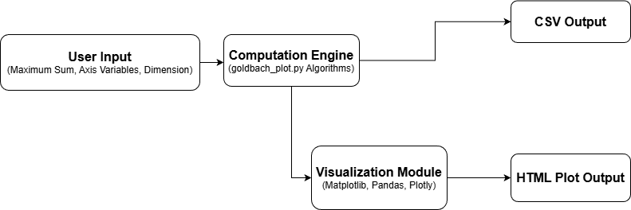
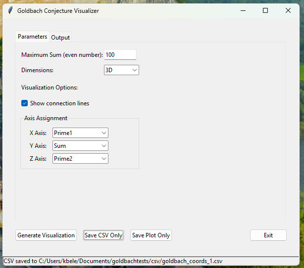
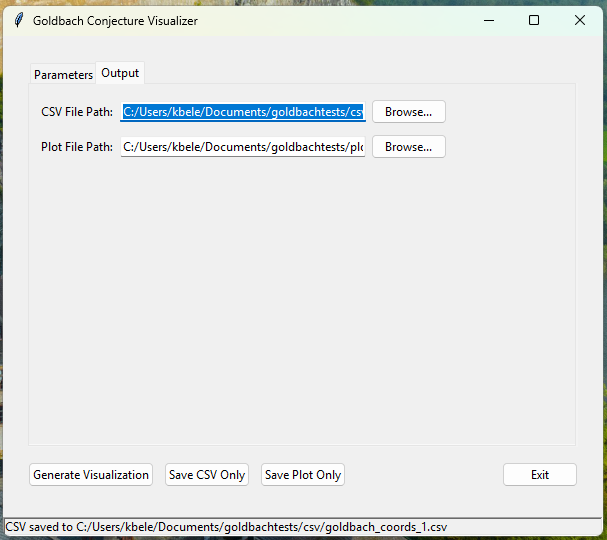
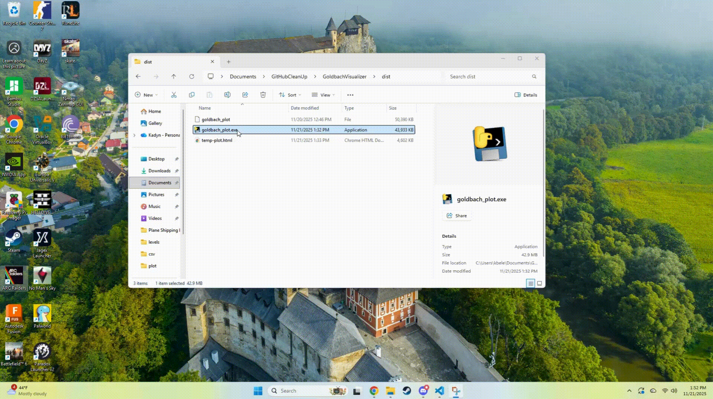
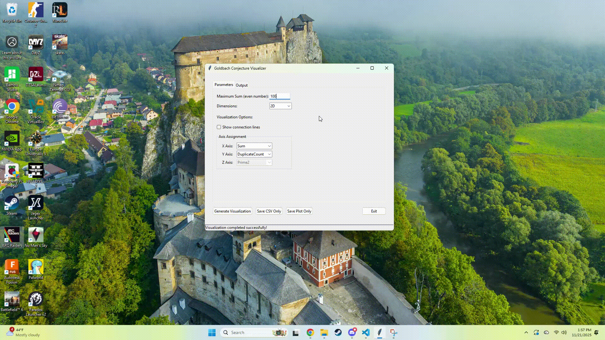
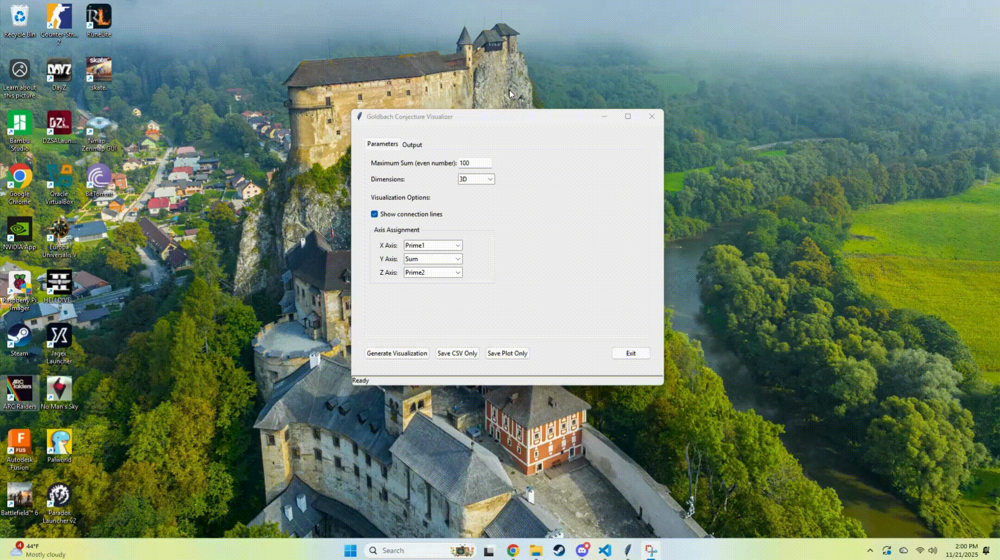
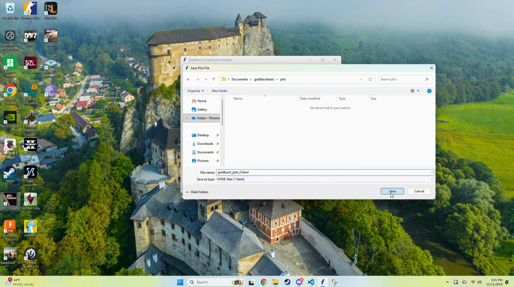
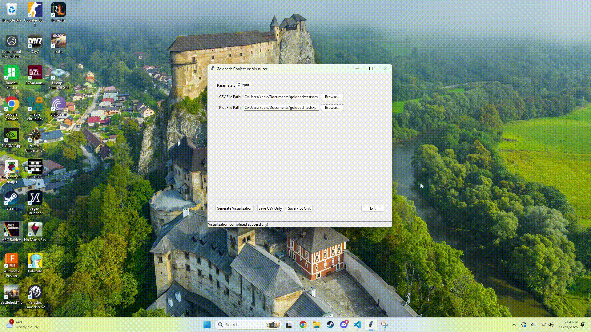

# Goldbach Visualizer User Guide

## Installation

1. Navigate to **https://github.com/gigoiy/GoldbachVisualizer.git**
2. Click **<> Code**
3. Click **Download ZIP**
4. Extract the ZIP folder to a location you desire

## Usage

1. Navigate to `...\GoldbachVisualizer\dist`
2. Depending on your operating system, run the proper executable `goldbach_plot`
3. Start experimenting with the many different and new ways that we can visualize Goldbach's Conjecture!

## Program Architecture

## GUI Breakdown

- **Maximum Sum:** Sets the maximum sum that the program generates.
- **Dimensions:** Switch between 2D and 3D visualizations.
- **Show Connection Lines:** Toggle the connection lines on/off, connection lines are unavailable for 2D visualizations.
- **Axis Assignment:** Assign a variable to each axis of the visualization. **Index1** and **Index2** are the relating indexes of each calculated prime. **DuplicateCount** is the amount of duplicates that each sum has.

- **CSV File Path:** Sets the file name and save location of the CSV file that's about to be generated.
- **Plot File Path:** Sets the file name and save location of the HTML Plot file that's about to be generated.
- **Generate Visualization:** Generates and loads the visualization and saves both the CSV and the HTML Plot files to the specified file paths on the Output page.
- **Save CSV Only:** Doesn't generate any visualizations, but saves only the CSV file to the specified CSV file path.
- **Save Plot Only:** Only generates and saves the HTML Plot file to the specified plot file path.

### Visualizing in 3D

### Visualizing in 2D

### Saving Plots and CSVs

